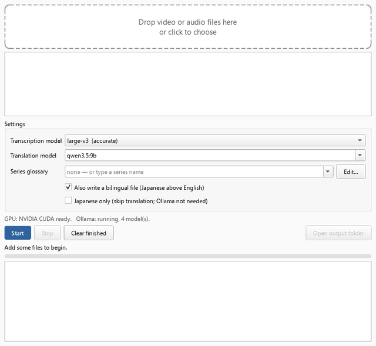
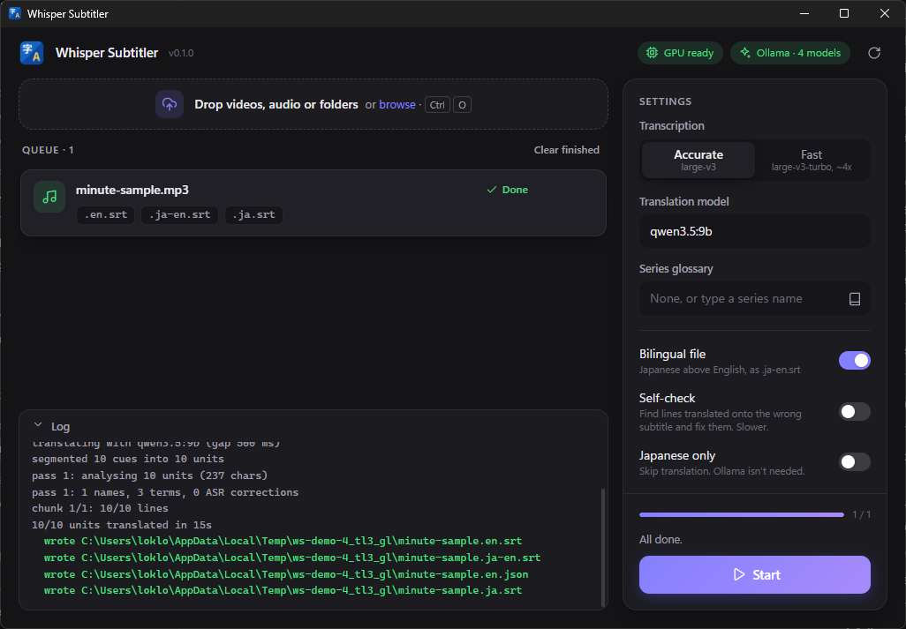

# Whisper Subtitler

English subtitles for any Japanese video or audio file, made entirely on your
own machine. It needs no cloud services and no API key, and nothing is charged
per file.



Drop a file in and get `.srt` subtitles beside it: English, Japanese, and
optionally both together. It works on the videos that have no caption track,
such as local recordings, Niconico and Bilibili downloads, and stream
archives. Its sister project [jp-subs](https://github.com/EmanChan050528/jp-subs)
does the same for YouTube videos that do have captions. Together they make one
local-AI subtitle toolkit.

## How it works

1. **Transcribe.** [faster-whisper](https://github.com/SYSTRAN/faster-whisper)
   (large-v3) writes the Japanese with a timestamp on every word. A second
   pass re-transcribes stretches where speech was detected but no words came
   back. Whisper tends to skip voice acting under music, and this pass halves
   the lines it misses.
2. **Translate.** A local LLM on [Ollama](https://ollama.com) (qwen3.5:9b by
   default) translates in two passes, ported from jp-subs. Pass 1 reads the
   whole transcript and builds a glossary of names, terms and likely
   mishearings. Pass 2 translates in chunks, with context on both sides of each.
3. **Time.** Each subtitle starts when its words start. It stays up long
   enough to read, never overlaps the next one, and doesn't flicker.

Details that took measuring to get right:

- **Lines stay on their own subtitle.** On fragmented conversation, the model
  used to rebuild whole sentences and spread the English across neighbouring
  lines. Now it copies each Japanese line before translating it, and any copy
  that doesn't match its line is caught and retried.
- **Invented text is filtered out.** Over music, Whisper writes things like
  「ご視聴ありがとうございました」 ("thanks for watching") that nobody said. These
  are dropped only when the audio also looks like non-speech, so a real
  sign-off is kept.
- **Series glossaries.** With a glossary, a character is translated the same
  way every episode. Fix a name once in the glossary file and it stays fixed.
- **Interruptions are safe.** Progress is saved every ~10 minutes of audio and
  after every translation chunk. Stopping is really pausing. Audio is
  streamed, so a 10-hour archive needs no more memory than a 10-minute clip.
- **Optional self-check.** `--check` has a model confirm which line each
  English subtitle belongs to, and re-translates any run that landed on a
  neighbour.

The measurements behind each decision, including the ideas that were tried and
dropped, are in [docs/benchmarks.md](docs/benchmarks.md).

## Speed

On an RTX 5070 (12 GB): a 22-minute video takes about **3½ minutes**, and an
hour of conversation about **10 minutes**. Whisper and the LLM take turns on
the GPU. Without an NVIDIA GPU everything still works, but slowly.

## Install

You need [Ollama](https://ollama.com) running with a translation model:

```bash
ollama pull qwen3.5:9b
```

**From source** (Windows, Python 3.11 or later):

```bash
git clone https://github.com/EmanChan050528/whisper-subs
cd whisper-subs
py -3.11 -m venv .venv
.venv/Scripts/python -m pip install -e ".[gui,cuda]"
```

Leave out `cuda` on a machine without an NVIDIA GPU. It installs cuBLAS as a
pip wheel, so no CUDA toolkit is needed.

**Standalone build**: `packaging/whisper-subs.spec` builds a folder with both
programs and no Python required (about 1 GB, mostly cuBLAS). See
[Building](#building).

The window runs in Microsoft Edge WebView2, which Windows 10 and 11 already
include.

The first run downloads the Whisper model (large-v3, 2.9 GB).

## Use

**The window:** run `whisper-subs-gui`, or `Whisper Subtitler.exe` in a
build. Drop files or whole folders anywhere on it, press **Start**, and the
subtitles appear next to each file. Click a finished file's subtitles to see
them in Explorer. **Pause** stops after the current step, and **Resume**
carries on from there.



**The command line:**

```bash
whisper-subs video.mp4               # video.en.srt, plus video.ja.srt
whisper-subs video.mp4 --bilingual   # also video.ja-en.srt (Japanese above English)
whisper-subs video.mp4 --ja-only     # Japanese only; Ollama not needed
whisper-subs ep02.mp4 --glossary my-show   # keep names consistent across a series
whisper-subs video.ja.json           # translate again without re-transcribing
whisper-subs video.mp4 --fast        # large-v3-turbo: ~4x faster transcription, weaker on rare words
whisper-subs video.mp4 --check       # afterwards, find and fix lines translated onto the wrong subtitle
```

Run the same command again after an interruption and it resumes. `--force`
starts over. `whisper-subs --help` lists everything.

**Glossaries** are JSON files in `%APPDATA%\whisper-subs\glossaries\` (the
window's **Edit…** button opens the folder). If a name comes out wrong, correct
it there. Existing entries always win when a new file's findings are merged in.

## Limitations

- **Overlapping speech** comes out as one speaker's words, or a mix of both.
  It hasn't been measured yet.
- **Long music-only stretches** (stream waiting screens) are where invented
  text is most likely. The filters catch the known phrases; `--vad` skips
  non-speech entirely, at the cost of losing quiet speech.
- **Songs** are best effort: Whisper misses verses and invents credits.
- **Very long lines stay long.** A subtitle only splits at a real pause
  between clauses; dense continuous speech keeps one long subtitle rather
  than being cut mid-sentence.

## Building

```bash
.venv/Scripts/python -m pip install -e ".[gui,cuda]" pyinstaller
.venv/Scripts/python scripts/build_app.py
```

This produces `dist/whisper-subs/`. `Whisper Subtitler.exe` is the app, and
`whisper-subs.exe` is the same pipeline for the command line. They share the
`_internal` folder, and a `README.txt` beside them says which is which.
PyInstaller's scratch files go to the temp folder, not `build/`.

The script also puts a **`Whisper Subtitler.lnk` shortcut in the repo folder**,
so the app opens from there. It's a shortcut rather than a copy because the
program only runs next to its `_internal` folder. It holds this machine's path,
so it isn't committed; each build makes its own. Only cuBLAS is bundled from CUDA. A transcription never
loads cuDNN, which saves 1.3 GB.

## Development

```bash
.venv/Scripts/python -m pip install -e ".[dev,gui,cuda]"
.venv/Scripts/python -m pytest
```

The translation pipeline is checked byte for byte against jp-subs' JavaScript
(`tests/parity/`), using a fake model that drops lines, wraps replies in prose and fails pass 1
on purpose.
[docs/DEVELOPMENT.md](docs/DEVELOPMENT.md) is the build log, milestone by
milestone. `scripts/gpu_check.py` measures Whisper speed on any file, and
`eval/score.py` scores subtitles against a reference transcript.

## Credits

- Speech recognition: OpenAI's Whisper, run by [faster-whisper](https://github.com/SYSTRAN/faster-whisper).
- Translation: any model on [Ollama](https://ollama.com); the default is Qwen 3.5 (9B).
- Translation pipeline: ported from [jp-subs](https://github.com/EmanChan050528/jp-subs).
- The icon's lettering is [Noto Sans JP](https://fonts.google.com/noto/specimen/Noto+Sans+JP), SIL Open Font License 1.1.
